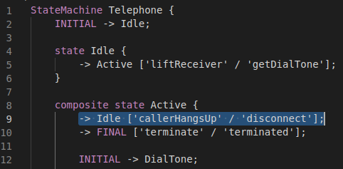
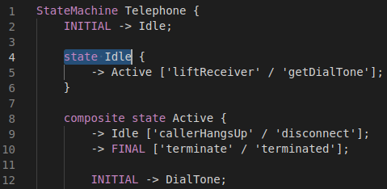
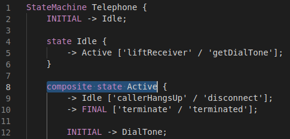

# State-Machines
Python implementation of simplified State Machines. Uses ANTLR4 for parsing.

## Requirements

- [Python](https://www.python.org/) version 3.10 or higher
- [gevent](https://pypi.org/project/gevent/)
- [BSON-RPC](https://pypi.org/project/bsonrpc/)
- [ANTLR4 Runtime](https://pypi.org/project/antlr4-python3-runtime/)

## Domain-Specific Breakpoints

This runtime supports domain-specific breakpoints that are put either on transitions or states.

### Breakpoint Location

The accepted location for a breakpoint on a transition is as follows:

The accepted location for a breakpoint on a state (either simple or composite) is as follows:

### Breakpoint Semantics

The semantics of the available breakpoint types related to transitions are:

- **Transition Fired**: Breaks when a specific transition is fired.

The semantics of the available breakpoint types related to states are:

- **State Reached**: Breaks when a specific state is about to be reached.
- **State Exited**: Breaks when a specific state is about to be exited.